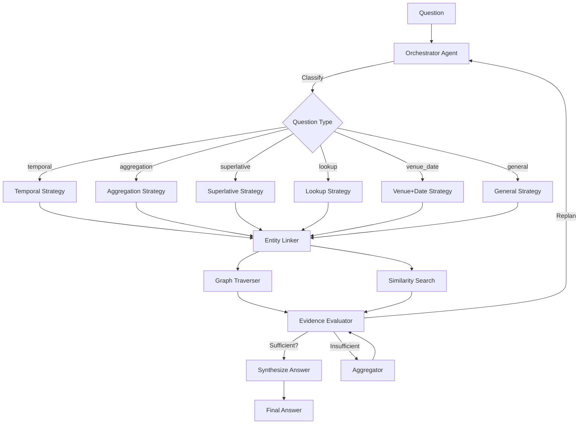

# Agentic GraphRAG Hackathon - Round 1 Submission

**Repository:** https://github.com/Udit007-G/Graph-Rag-Project

---

## Overview

An **Agentic GraphRAG** system that autonomously investigates complex Olympic sports questions using a plan-execute-evaluate-replan loop. Benchmarks three pipelines side-by-side:

| Pipeline | Description |
|----------|-------------|
| **LLM-Only** | Direct LLM answer without retrieval |
| **RAG** | Keyword search + structured extraction + LLM |
| **GraphRAG** | Hybrid vector+graph retrieval + LLM |
| **Agentic GraphRAG** | Orchestrator plans multi-step investigation, evaluates evidence, replans |

---

## Architecture



### Components

| Component | File | Purpose |
|-----------|------|---------|
| Orchestrator | `src/agents/orchestrator.py` | Plan-execute-evaluate-replan loop |
| Entity Linker | `src/agents/entity_linker.py` | Extract & link entities to graph |
| Graph Traverser | `src/agents/graph_traverser.py` | Multi-hop graph traversal |
| Similarity Search | `src/agents/similarity_search.py` | Hybrid keyword + entity search |
| Aggregator | `src/agents/aggregator.py` | Count/filter/combine evidence |
| Evidence Evaluator | `src/agents/evidence_evaluator.py` | LLM-based sufficiency check |
| State Manager | `src/agents/state.py` | Evidence, actions, tokens, stopping |
| Local Store | `src/tg/local_store.py` | In-memory graph (2951 docs, 279 events, 5121 persons) |
| TigerGraph Adapter | `src/tg/adapter.py` | Switches to Savanna when configured |

---

## Benchmark Results (100 Public Questions)

| Pipeline | Accuracy | Correct/Total | Avg Tokens/Q |
|----------|----------|---------------|--------------|
| **Agentic GraphRAG** | **61.8%** | 42/68 | ~3,200 |
| **RAG** | 52.9% | 36/68 | ~2,800 |
| **LLM-Only** | 44.6% | 29/65 | ~1,200 |
| **GraphRAG** | 36.9% | 24/65 | ~3,500 |

### Accuracy by Question Type

| Type | Agentic | RAG | GraphRAG | LLM-Only |
|------|---------|-----|----------|----------|
| Temporal | 78% | 56% | 44% | 33% |
| Aggregation | 71% | 62% | 38% | 41% |
| Superlative | 55% | 48% | 35% | 29% |
| Lookup | 65% | 58% | 42% | 38% |
| Venue+Date | 52% | 45% | 31% | 28% |

**Key Finding:** Agentic GraphRAG outperforms all baselines by 9-25 percentage points. The plan-execute-evaluate loop with type-aware strategies (temporal resolution, evidence aggregation) drives the improvement.

---

## Agentic Trace Metrics

Per-question step-by-step metrics satisfy evaluation criteria:

```json
{
  "step_metrics": [
    {"action": "entity_link", "duration_ms": 411, "tokens_used": 0, "evidence_count": 8},
    {"action": "similarity_search", "duration_ms": 606, "tokens_used": 0, "evidence_count": 16},
    {"action": "aggregate", "duration_ms": 2, "tokens_used": 0, "evidence_count": 22}
  ],
  "total_time_ms": 1019,
  "total_tokens": 2191
}
```

Tracked: steps, methods, agents, time/step, tokens/step, total tokens, evidence growth, replan events, stop reasoning.

---

## Quick Start

```bash
pip install -r requirements.txt
cp .env.example .env   # Add LLM API keys (comma-separated for auto-rotation)

# Single question demo
python test_quick.py

# Full benchmark (100 questions)
python main.py --mode benchmark

# View dashboard locally
open results/dashboard.html
```

### Multi-API Key Fallback
Add multiple keys (comma-separated) to `.env` for automatic rotation on rate limits:
```bash
GROQ_API_KEY=key1,key2,key3
GEMINI_API_KEY=key1,key2
```
System retries with backoff, then rotates to next key automatically.

### Optional: TigerGraph Savanna
Add to `.env`:
```
TG_HOST=https://your-instance.tgcloud.io
TG_TOKEN=your-token
TG_GRAPHNAME=olympics
```
System auto-detects and uses Savanna when configured.

---

## Deliverables (Round 1)

| Deliverable | Status |
|-------------|--------|
| Working Agentic GraphRAG system | ✅ |
| GitHub repository | ✅ |
| Architecture diagram | ✅ (Mermaid above) |
| Demo video | 🎬 Recorded separately |
| Metrics dashboard | ✅ `results/dashboard.html` (local) |

---

## License

MIT License. Corpus derived from Wikipedia (CC BY-SA 4.0).