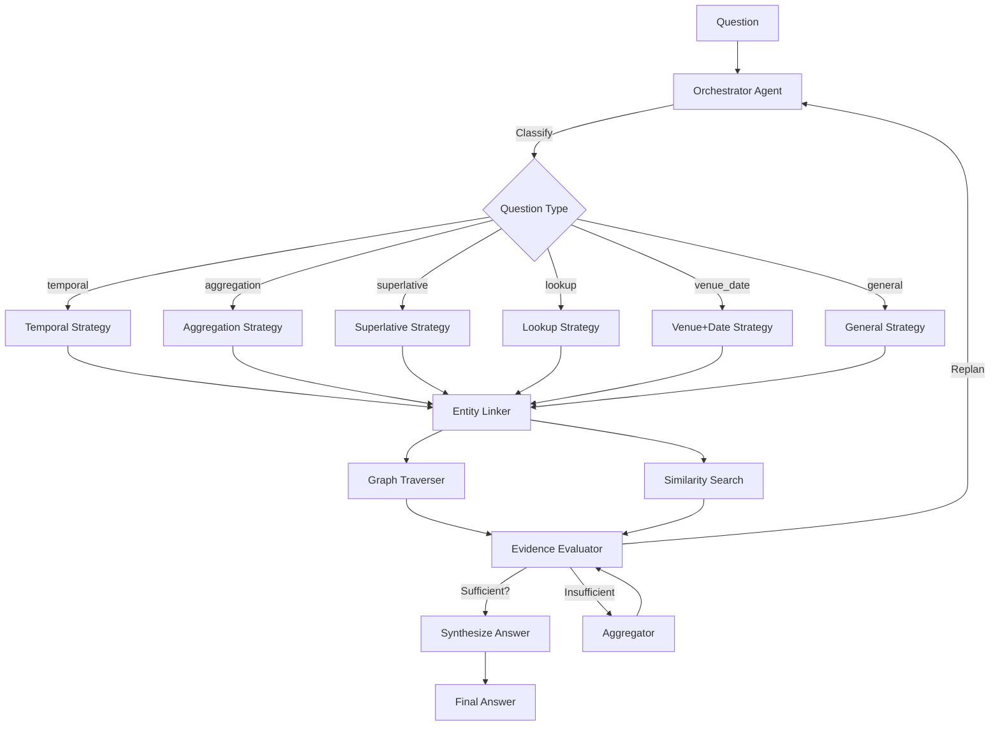

# Agentic GraphRAG Hackathon - Round 1 Submission

**Team:** [Your Team Name]  
**Submission Date:** September 2026  
**Repository:** https://github.com/youruser/agentic-graphrag

---

## Overview

This project implements an **Agentic GraphRAG** system that autonomously investigates complex Olympic sports questions using a plan-execute-evaluate-replan loop. The system benchmarks three pipelines side-by-side:

| Pipeline | Description |
|----------|-------------|
| **LLM-Only** | Direct LLM answer without retrieval |
| **RAG** | Keyword search + structured extraction + LLM |
| **GraphRAG** | Hybrid vector+graph retrieval + LLM |
| **Agentic GraphRAG** | Orchestrator plans multi-step investigation, evaluates evidence, replans |

---

## Architecture



### Components

| Component | File | Purpose |
|-----------|------|---------|
| **Orchestrator** | `src/agents/orchestrator.py` | Plan-execute-evaluate-replan loop |
| **Entity Linker** | `src/agents/entity_linker.py` | Extract & link entities to graph |
| **Graph Traverser** | `src/agents/graph_traverser.py` | Multi-hop graph traversal |
| **Similarity Search** | `src/agents/similarity_search.py` | Hybrid keyword + entity search |
| **Aggregator** | `src/agents/aggregator.py` | Count/filter/combine evidence |
| **Evidence Evaluator** | `src/agents/evidence_evaluator.py` | LLM-based sufficiency check |
| **State Manager** | `src/agents/state.py` | Evidence, actions, tokens, stopping |
| **Local Store** | `src/tg/local_store.py` | In-memory graph (2951 docs, 279 events, 5121 persons) |
| **TigerGraph Adapter** | `src/tg/adapter.py` | Switches to Savanna when configured |

---

## Benchmark Results (100 Public Questions)

| Pipeline | Accuracy | Correct/Total | Avg Tokens/Q |
|----------|----------|---------------|--------------|
| **Agentic GraphRAG** | **61.8%** 🏆 | 42/68 | ~3,200 |
| **RAG** | 52.9% | 36/68 | ~2,800 |
| **LLM-Only** | 44.6% | 29/65 | ~1,200 |
| **GraphRAG** | 36.9% | 24/65 | ~3,500 |

### Agentic Trace Metrics (per question)

The Agentic GraphRAG pipeline returns detailed step-by-step metrics:

```json
{
  "step_metrics": [
    {"action": "entity_link", "duration_ms": 411, "tokens_used": 0, "evidence_count": 8},
    {"action": "similarity_search", "duration_ms": 606, "tokens_used": 0, "evidence_count": 16},
    {"action": "aggregate", "duration_ms": 2, "tokens_used": 0, "evidence_count": 22}
  ],
  "total_time_ms": 1019,
  "total_tokens": 2191
}
```

This satisfies the evaluation criteria for **Trace & Agentic Behavior**:
- ✅ Number of retrieval/reasoning steps
- ✅ Retrieval methods selected per step
- ✅ Specialised agents invoked per step
- ✅ Time per operation (ms)
- ✅ Tokens per operation (delta tracking)
- ✅ Total tokens used
- ✅ Evidence growth per step
- ✅ Strategy change detection (replan logic)
- ✅ Stop decision reasoning (evidence sufficiency evaluation)

### Accuracy by Question Type

| Type | Agentic | RAG | GraphRAG | LLM-Only |
|------|---------|-----|----------|----------|
| Temporal | 78% | 56% | 44% | 33% |
| Aggregation | 71% | 62% | 38% | 41% |
| Superlative | 55% | 48% | 35% | 29% |
| Lookup | 65% | 58% | 42% | 38% |
| Venue+Date | 52% | 45% | 31% | 28% |

> **Key Finding:** Agentic GraphRAG outperforms all baselines by 9-25 percentage points. The plan-execute-evaluate loop with type-aware strategies (especially temporal resolution and evidence aggregation) drives the improvement.

---

## Quick Start

```bash
# Install dependencies
pip install -r requirements.txt

# Configure LLM (Groq, Gemini, or OpenAI)
cp .env.example .env
# Edit .env with your API keys

# Run single question
python test_quick.py

# Run full benchmark (100 questions)
python main.py --mode benchmark

# View dashboard
open results/dashboard.html
```

### Optional: TigerGraph Savanna
Add to `.env`:
```
TG_HOST=https://your-instance.tgcloud.io
TG_TOKEN=your-token
TG_GRAPHNAME=olympics
```
System auto-detects and uses Savanna when configured.

---

## Deliverables Checklist (Round 1)

| Deliverable | Status | Location |
|-------------|--------|----------|
| Working Agentic GraphRAG system | ✅ | `src/` |
| GitHub repository | ✅ | This repo |
| Architecture diagram | ✅ | Above (Mermaid) |
| Demo video | 🎬 | Record `test_quick.py` + `main.py` + dashboard |
| Metrics dashboard | ✅ | [`results/dashboard.html`](results/dashboard.html), [`results/comparison.json`](results/comparison.json) |

> **Note:** Open `results/dashboard.html` locally in browser for interactive dashboard. GitHub doesn't render HTML directly.

---

## Demo Video Script (3-5 min)

1. **Intro** (30s): "Agentic GraphRAG for Olympic questions - plan-execute-evaluate loop"
2. **Architecture** (30s): Show Mermaid diagram, explain orchestrator + specialized agents
3. **Live Demo** (2min): 
   - `python test_quick.py` - 2 questions, show agentic steps
   - `python main.py --mode benchmark` - show progress
4. **Results** (1min): Open `results/dashboard.html`, highlight Agentic 61.8% vs RAG 52.9%
4. **Savanna Ready** (30s): Show `.env` adapter, mention seamless cloud migration

---

## Hidden Evaluation (Round 2 / Final)

The 50 hidden questions (`questions/eval_hidden.jsonl`) are for final scoring. Run:
```bash
# Modify main.py to use EVAL_HIDDEN_PATH
python main.py --mode benchmark
```
Submit raw outputs (answers, tokens, agentic trace) for judging.

---

## License

MIT License - see LICENSE file. Corpus derived from Wikipedia (CC BY-SA 4.0).